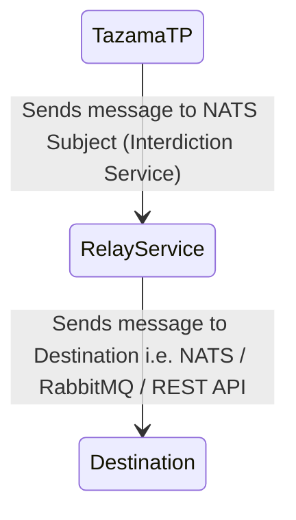
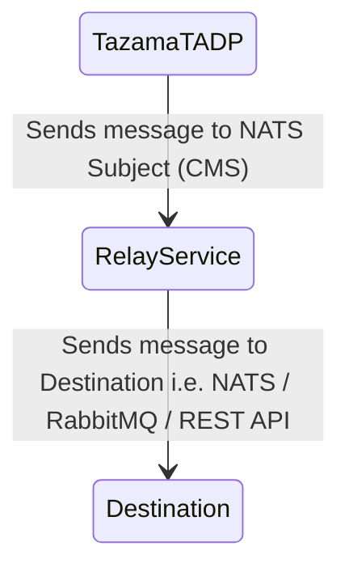

# **Tazama Relay Service**

## _Relay Service Documentation_

**Table of Contents**

- [**Tazama Relay Service**](#tazama-relay-service)
  - [_Relay Service Documentation_](#relay-service-documentation)
  - [**_1. Component Overview_**](#1-component-overview)
    - [1.1 An overview of the document and its purpose](#11-an-overview-of-the-document-and-its-purpose)
    - [1.2 Features](#12-features)
    - [1.3 Major Functions](#13-major-functions)
      - [1. Relay to NATS](#1-relay-to-nats)
      - [2. Relay to RabbitMQ](#2-relay-to-rabbitmq)
      - [3. Relay to REST API](#3-relay-to-rest-api)
  - [**_2. System Architecture_**](#2-system-architecture)
    - [2.1 Relay Service to NATS / RabbitMQ / REST API for TazamaTP](#21-relay-service-to-nats--rabbitmq--rest-api--for-tazamatp)
    - [2.2 Relay Service to NATS / RabbitMQ / REST API for TazamaTADP](#22-relay-service-to-nats--rabbitmq--rest-api-for-tazamatadp)
  - [**_3. Configuration_**](#3-configuration)
  - [**_4. Deployment Guide_**](#4-deployment-guide)
    - [1. Clone the Repository](#1-clone-the-repository)
    - [2. Open your terminal and run the following command to clone the repository:](#2-open-your-terminal-and-run-the-following-command-to-clone-the-repository)
    - [3. Configure Environment Variables](#3-configure-environment-variables)
    - [4. Build the Docker Image](#4-build-the-docker-image)
    - [5. Run the Docker Container](#5-run-the-docker-container)
  - [**_5. Running the Service_**](#5-running-the-service)
  - [**_6. Contributor Information_**](#6-contributor-information)

## **_1. Component Overview_**

It is a TypeScript-based service that bridges communication between TMS (Tazama Monitoring Service) and client applications handling transaction processing and analysis.

### 1.1 An overview of the document and its purpose

This service acts as an intermediary, reading messages from a NATS server and forwarding them to various client-side message queue implementations, including RabbitMQ, REST API, or NATS. Its primary purpose is to facilitate seamless communication between TMS and transaction processing/analysis applications.

### 1.2 Features

- Supports multiple input sources: NATS
- Compatible with various output destinations: RabbitMQ, REST API, and NATS
- Built using TypeScript for enhanced type safety and maintainability
- Designed specifically for financial risk management and transaction processing scenarios

### 1.3 Major Functions

The Message Relaying Service offers several core functions that work together to enable efficient message forwarding. These functions are designed to handle different aspects of the message relaying process.

- ### Start Function

typescript start: () => Promise<boolean>

The `start` function initializes the service by setting up subscribers to read messages from the configured input source. After successful initialization, it calls the `relayMessage` function to begin the message forwarding process.

- ### Initialize Producer Function

typescript initProducer: () => Promise<boolean>

This function is responsible for setting up a producer connection based on the destination type specified in the configuration (`config.destinationType`). The function supports three destination types: NATS, RabbitMQ, and REST API. It establishes the appropriate connection and prepares the service for relaying messages to the destination.

- ### Relay Message Function

typescript relayMessage: (message: Uint8Array) => Promise<void>

This function acts as the central hub for message forwarding. It determines the appropriate destination service/messaging queue based on the (`config.destinationType`) and calls the corresponding relay function. Supported destinations include RabbitMQ, NATS, and REST API.

- ### Destination-Specific Relay Functions

The following functions handle the actual forwarding of messages to their respective destinations:

#### 1. Relay to NATS

typescript relayToNats: (message: string) => Promise<boolean>

This function forwards messages to a NATS listener.

#### 2. Relay to RabbitMQ

typescript relayToRabbitMQ: (message: string) => Promise<boolean>

This function sends messages to a RabbitMQ listener.

#### 3. Relay to REST API

typescript relayToRestAPI: (message: string) => Promise<void>

This function forwards messages to an endpoint on a server via REST API.

## **_2. System Architecture_**

This section provides an overview of how the Relay Service interacts with different components in the Tazama ecosystem. The diagrams illustrate the flow of messages from TazamaTP and TazamaTADP through the Relay Service to various destinations, such as NATS, RabbitMQ, or REST APIs.

### 2.1 Relay Service to NATS / RabbitMQ / REST API for TazamaTP



### 2.2 Relay Service to NATS / RabbitMQ / REST API for TazamaTADP



## **_3. Configuration_**

The service can be configured through environment variables or a configuration file. Refer to the `.env.template.*` or `/config/index.ts` file based on your requirement for available settings.

- ## _Environment Variables_

The service can be configured using the following environment variables:

- ### Init Variables

| Variable      | Description                                            |
| ------------- | ------------------------------------------------------ |
| STARTUP_TYPE  | nats                                                   |
| NODE_ENV      | Node.js environment (e.g., production, development)    |
| MAX_CPU       | CPU Limit for LoggerService                            |
| FUNCTION_NAME | Name of the function associated with the relay service |

- ### Consumer Variables

1. #### Nats Consumer Variables

| Variable        | Description                              |
| --------------- | ---------------------------------------- |
| CONSUMER_URL    | URL for the NATS consumer                |
| CONSUMER_STREAM | Name of the stream for the NATS consumer |

- ### Destination Variables

1. #### Nats Producer Variables

| Variable         | Description                              |
| ---------------- | ---------------------------------------- |
| DESTINATION_TYPE | nats                                     |
| DESTINATION_URL  | URL for the NATS destination             |
| PRODUCER_STREAM  | Name of the stream for the NATS producer |

2. #### RabbitMQ Producer Variables

| Variable         | Description                                 |
| ---------------- | ------------------------------------------- |
| DESTINATION_TYPE | rabbitmq                                    |
| DESTINATION_URL  | URL for the RabbitMQ destination            |
| Queue            | Name of the queue for the RabbitMQ producer |

3. #### RESTAPI Producer Variables

| Variable         | Description                                    |
| ---------------- | ---------------------------------------------- |
| DESTINATION_TYPE | rest                                           |
| DESTINATION_URL  | URL for the REST API destination               |
| JSON_PAYLOAD     | Delivery message as JSON (true/false)          |
| MAX_SOCKETS      | Max http/https sockets limit (2500 by default) |

- ### General Configuration

| Variable    | Description                                    |
| ----------- | ---------------------------------------------- |
| SUBSCRIBERS | Number of consumer subs. (Min 500 recommended) |

## **_4. Deployment Guide_**

- ### **Pre-requisites:**

Before starting, ensure the following is in place:
Docker is installed on your system.
You have access to the repository that contains the Relay Service code.

- ### **Step-by-Step Deployment Instructions:**

#### 1. Clone the Repository

#### 2. Open your terminal and run the following command to clone the repository:

```bash
git clone <repository-link>
```

#### 3. Configure Environment Variables

Update the environment configuration file (.env) as per your system's requirements. Make sure to correctly configure any database or service connection details.

#### 4. Create .npmrc File

Create a .npmrc file if you currently do not have. Add the following content:

```bash
@tazama-lf:registry=https://npm.pkg.github.com
//npm.pkg.github.com/:_authToken=some-secret
```

#### 5. Build the Docker Image

Once the environment is configured, build the Docker image using the following command:

```bash
docker compose build -t your-image-name
```

#### 6. Run the Docker Container

After building the image, start the service in detached mode (in the background) using the command:

```bash
docker compose up -d your-image-name
```

## **_5. Running the Service_**

Once configured, the service will automatically start reading messages from the specified input source and forwarding them to the designated output destination. This process involves:

1. Calling the `start()` function to initialize subscribers and begin message reading.
2. Processing incoming messages through the `relayMessage()` function.
3. Forwarding messages to the appropriate destination using one of the destination-specific relay functions.

The service continues to operate until manually stopped, continuously monitoring the input source and relaying messages as they arrive.

## **_6. Contributor Information_**

For any queries or assistance regarding the Relay service, you can reach out to the following contributors:

- **Muhammad Umair Khan**  
  GitHub ID: [@UmairKhan-Paysys](https://github.com/UmairKhan-Paysys)
